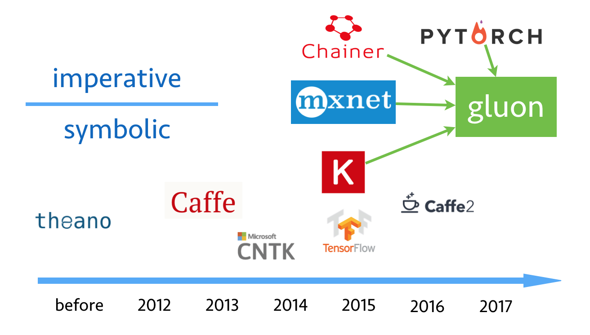

## An Introduction to MXNet/Gluon

MXNet is widely used in production environments owing to its strong reputation for speed. Now with `gluon`, MXNet’s new imperative interface, doing research in MXNet is easy. 

In this tutorial, we will walk through how to use `gluon` to implement various algorithms. We will present every concept in details, no deep learning background is required to attend. We encourage the audience to bring their laptops to have a hands-on experience with `gluon`. 

This tutorial is on **9AM--12AM, 7/26 Wed**, at **level 3, convention center**. The detailed schedule is as follows:

1. **9:00 - 9:30:** What is Gluon, why? [slides]
2. **9:30 - 10:30:** Part I:
    - 15min: n-dimensional arrays [notebook](http://gluon.mxnet.io/P01-C02-ndarray.html)
    - 15min: auto differentiation [notebook](http://gluon.mxnet.io/P01-C05-autograd.html)
    - 15min: linear regression [notebook I](http://gluon.mxnet.io/P02-C01-linear-regression-scratch.html), [notebook II](http://gluon.mxnet.io/P02-C02-linear-regression-gluon.html)
    - 15min: convolution neural networks [notebook I](http://gluon.mxnet.io/P04-C01-cnn-scratch.html), [notebook II](http://gluon.mxnet.io/P04-C02-cnn-gluon.html) 
3. **10:30 - 11:00:** Coffee break
4. **11:00 - 12:00:** Part II: 
    - 10min: hybridizing imperative and symbolic programming [notebook](http://gluon.mxnet.io/P14-C05-hybridize.html)
    - 10min: MXNet backend engine [slides]
    - 15min: multi-GPU and multi-machine [slides]
    - 15min: training with multi-GPUs [notebook I](http://gluon.mxnet.io/P14-C02-multiple-gpus-scratch.html), [notebook II](http://gluon.mxnet.io/P14-C03-multiple-gpus-gluon.html)
    - 5min: training with multi-machines [notebook](http://gluon.mxnet.io/P14-C03-multiple-gpus-gluon.html)

